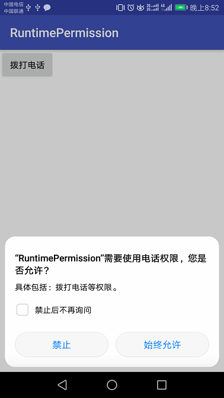

## Android运行时权限

Android从6.0开始，新增运行时权限，需要用户同意APP才能获取对应权限。下面以拨号为例，其他权限只需修改对应权限即可。

### 1、运行效果

### 2、权限判断

	//运行时权限检查
	if (ContextCompat.checkSelfPermission(this, Manifest.permission.CALL_PHONE)
	        != PackageManager.PERMISSION_GRANTED) {
	    //申请CALL_PHONE权限
	    ActivityCompat.requestPermissions(this, new String[]{Manifest.permission.CALL_PHONE},
	            REQUEST_CODE_CALL_PHONE);//自定义的code
	} else {//已经获取权限，直接拨号
	    showCallPhone();
	}

### 3、权限申请回调

 	@Override
    public void onRequestPermissionsResult(int requestCode, @NonNull String[] permissions, @NonNull int[] grantResults) {
        super.onRequestPermissionsResult(requestCode, permissions, grantResults);
        if (requestCode == REQUEST_CODE_CALL_PHONE && grantResults[0] == PackageManager.PERMISSION_GRANTED) {
            //获取到权限，做相应处理
            showCallPhone();
        }
    }

### 4、别忘了清单文件注册权限

	<uses-permission android:name="android.permission.CALL_PHONE"/>